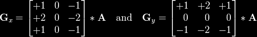
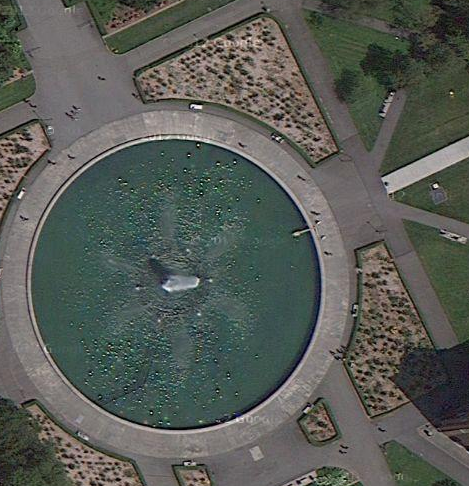
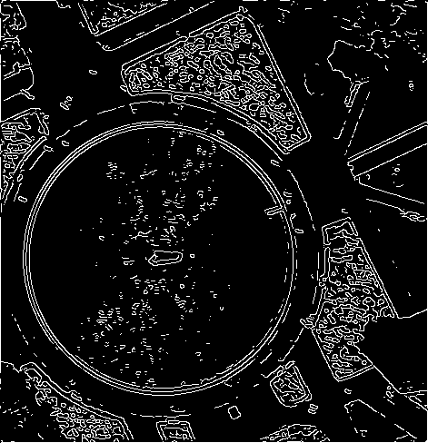
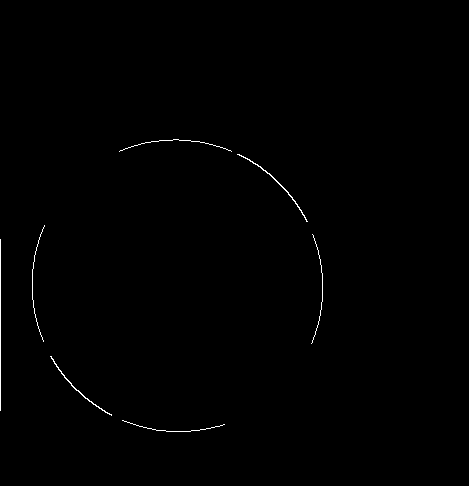
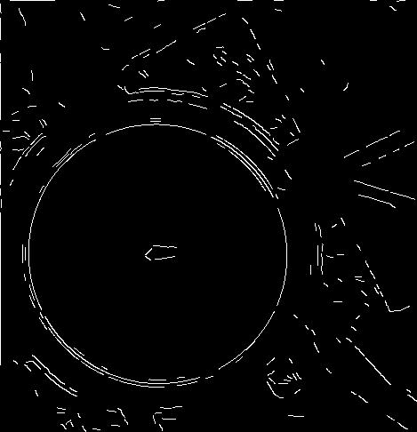

<!------------------------------------------------------------>
<!-- Topic: xxx -->

<h1>Tracing the Edge</h1>
<br>Raster Edge Detection for Geographic Analysis</br>
<br>...</br>
<h2>CUGOS Fall Fling 2013</h2>
<br>Andrew Powers</br>

--SUBSLIDE--

<h2>Tools</h2>
<br>Python: SciPy (Numpy)</br>
Google: Maps
<br>...</br>
<h2>Code:</h2>
http://cyroforge.wordpress.com/2012/01/21/canny-edge-detection/

<!------------------------------------------------------------>
--SLIDE--
<!-- Topic: yyy -->

<h1>Canny Filter</h1>

--SUBSLIDE--

<h2>noise reduction</h2>

--SUBSLIDE--

<h2>intensity gradient</h2>



horizontal and vertical derivatives

--SUBSLIDE--

<h2>thresholding</h2>

--SUBSLIDE--

<h2>non-maximum suppression</h2>

337.5<theta<22.5 & 157.5<theta<202.5

22.5<theta<67.5 & 202.5<theta<247.5

67.5<theta<112.5 & 247.5<292.5

112.5<theta<157.5 & 292.5<theta<337.5


--SUBSLIDE--

<h2>hysterisis</h2>

how the weak become strong

<!------------------------------------------------------------>
--SLIDE--
<!-- Topic: zzz -->

<h1>Geographic Features</h1>



--SUBSLIDE--

<h2>scale</h2>
```python
	groundResolution = (math.cos(latitude*math.pi/180)*2*math.pi*r_earth)/
	                   (256*math.pow(2,level))
					   
    mapScale = (groundResolution*dpi)/0.0254
```

--SUBSLIDE--

<h2>angle variance</h2>

--SUBSLIDE--

<h2>length</h2>

<!------------------------------------------------------------>
--SLIDE--
<!-- Topic: zzz -->

<h1>Results</h1>


--SUBSLIDE--

<h2>Canny</h2>



--SUBSLIDE--

<h2>Modified Curved</h2>



canny = Canny(low=10,high=30,length=5,angle=180,lat=47.653941,zoom=19)

--SUBSLIDE--

<h2>Straight</h2>



canny = Canny(low=10,high=30,length=2,angle=2,lat=47.653941,zoom=19)